# Sistema de Mensageria com RabbitMQ - Topic Exchange

<div align="center">
  
</div>

## Visão Geral

Este projeto demonstra a implementação de um sistema de mensageria assíncrona utilizando RabbitMQ com **Topic Exchange**, composto por um publicador (Publisher) e três consumidores (Receivers). A solução permite o envio e processamento de mensagens de forma desacoplada, escalável e com roteamento baseado em padrões de routing keys.

### Branch Atual: exchange/topic ✅

Esta branch implementa o **Topic Exchange**, que oferece roteamento flexível de mensagens usando padrões com wildcards (`*` e `#`), permitindo que múltiplas filas recebam mensagens com base em critérios específicos.

---

## Índice

1. [Visão Geral](#visão-geral)
2. [Arquitetura](#arquitetura)
3. [O que é RabbitMQ](#o-que-é-rabbitmq)
4. [Topic Exchange](#topic-exchange)
5. [Como Rodar](#como-rodar)
6. [Estrutura do Projeto](#estrutura-do-projeto)
7. [Exemplos de Uso](#exemplos-de-uso)
8. [Referência de APIs](#referência-de-apis)
9. [Troubleshooting](#troubleshooting)
10. [Best Practices](#best-practices)
11. [Recursos Adicionais](#recursos-adicionais)

---

## Arquitetura do Sistema

### Diagrama de Componentes

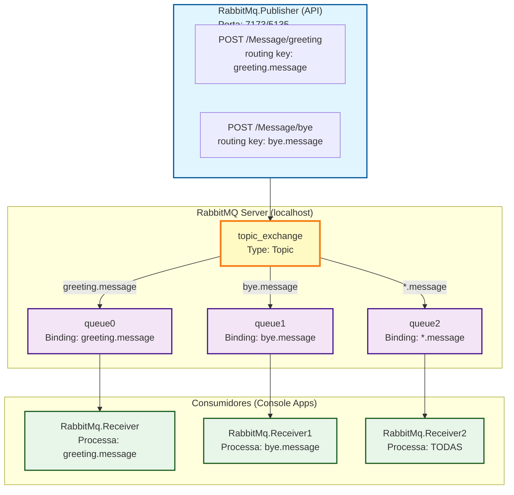

### Fluxo de Mensagens

#### Cenário 1: Mensagem de Saudação

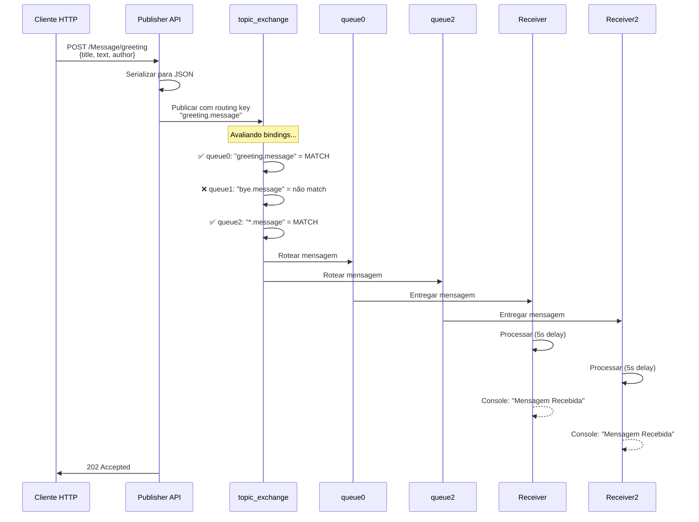

#### Cenário 2: Mensagem de Despedida

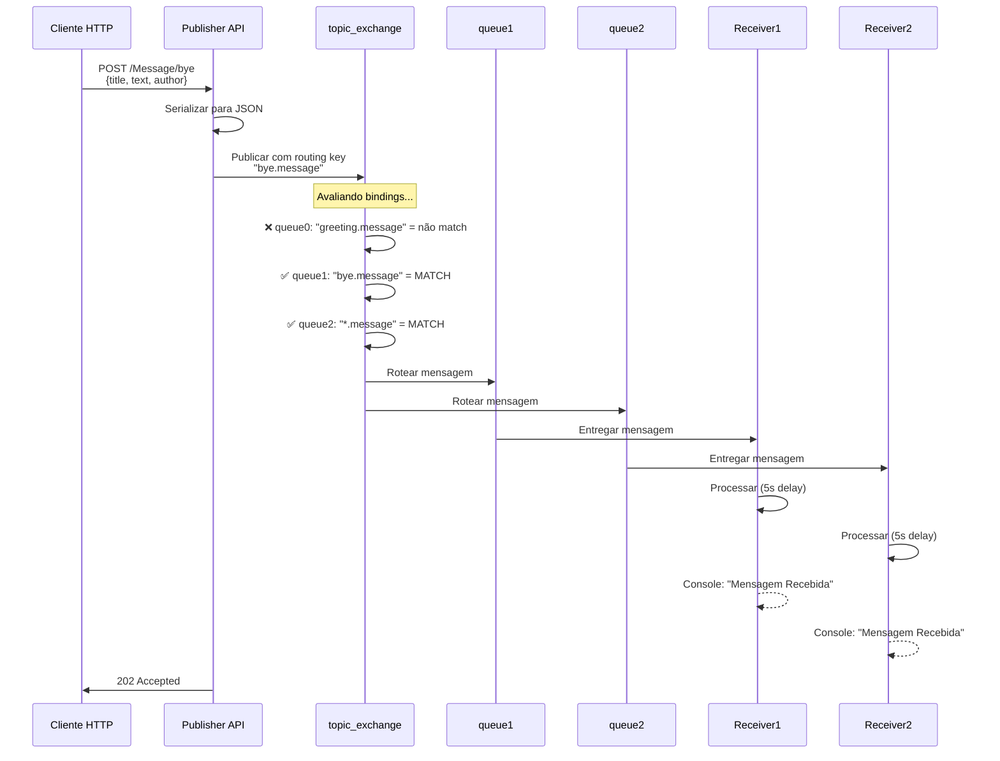

---

## O que é RabbitMQ?

RabbitMQ é um **message broker** (intermediário de mensagens) open-source que implementa o protocolo AMQP (Advanced Message Queuing Protocol). Ele atua como um intermediário entre aplicações, permitindo que sistemas se comuniquem de forma assíncrona através de filas de mensagens.

### Conceitos Fundamentais

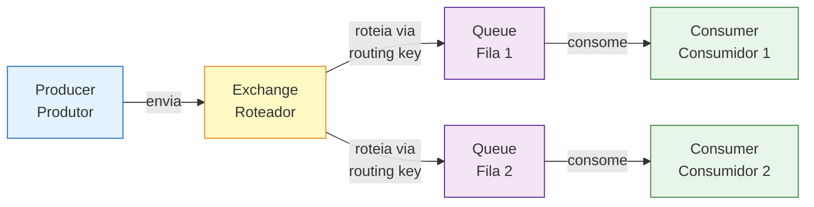

**Componentes principais:**

- **Producer (Produtor)**: Aplicação que envia mensagens para o exchange
- **Consumer (Consumidor)**: Aplicação que recebe e processa mensagens da fila
- **Exchange**: Componente que recebe mensagens do produtor e as roteia para filas
- **Queue (Fila)**: Estrutura de dados que armazena mensagens até serem consumidas
- **Binding**: Ligação entre exchange e fila com uma routing key específica
- **Routing Key**: Chave usada pelo exchange para decidir para quais filas enviar a mensagem
- **Channel (Canal)**: Conexão virtual dentro de uma conexão TCP
- **Connection (Conexão)**: Conexão TCP com o servidor RabbitMQ

---

## O que é Topic Exchange?

O **Topic Exchange** é um dos tipos de exchange mais flexíveis do RabbitMQ. Ele roteia mensagens para filas com base em padrões de correspondência entre a routing key da mensagem e as routing keys dos bindings.

### Características Principais

1. **Roteamento por Padrão**: Usa wildcards para criar regras flexíveis de roteamento
2. **Multi-destino**: Uma mensagem pode ser roteada para múltiplas filas
3. **Seletividade**: Consumidores podem escolher exatamente quais tipos de mensagens receber

### Wildcards no Topic Exchange

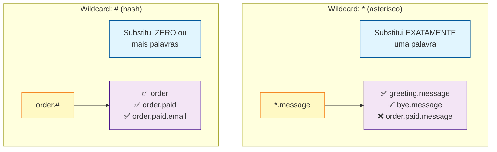

### Tabela de Wildcards

| Wildcard | Descrição | Exemplo |
|----------|-----------|---------|
| `*` (asterisco) | Substitui **exatamente uma palavra** | `*.message` corresponde a `greeting.message` ou `bye.message` |
| `#` (hash) | Substitui **zero ou mais palavras** | `order.#` corresponde a `order`, `order.paid` ou `order.paid.email` |

### Exemplos de Correspondência

**Routing Key da Mensagem: "greeting.message"**

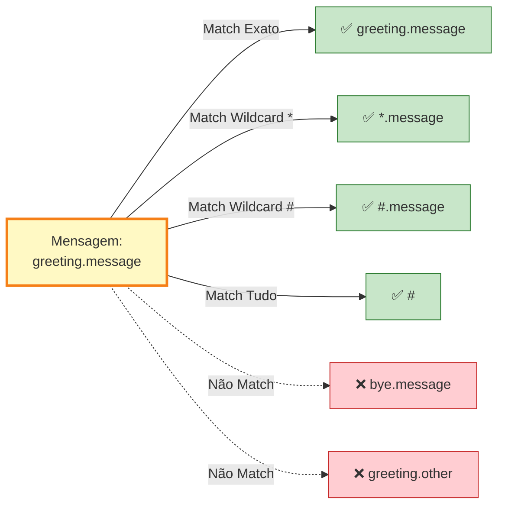

**Routing Key da Mensagem: "order.paid.confirmed"**

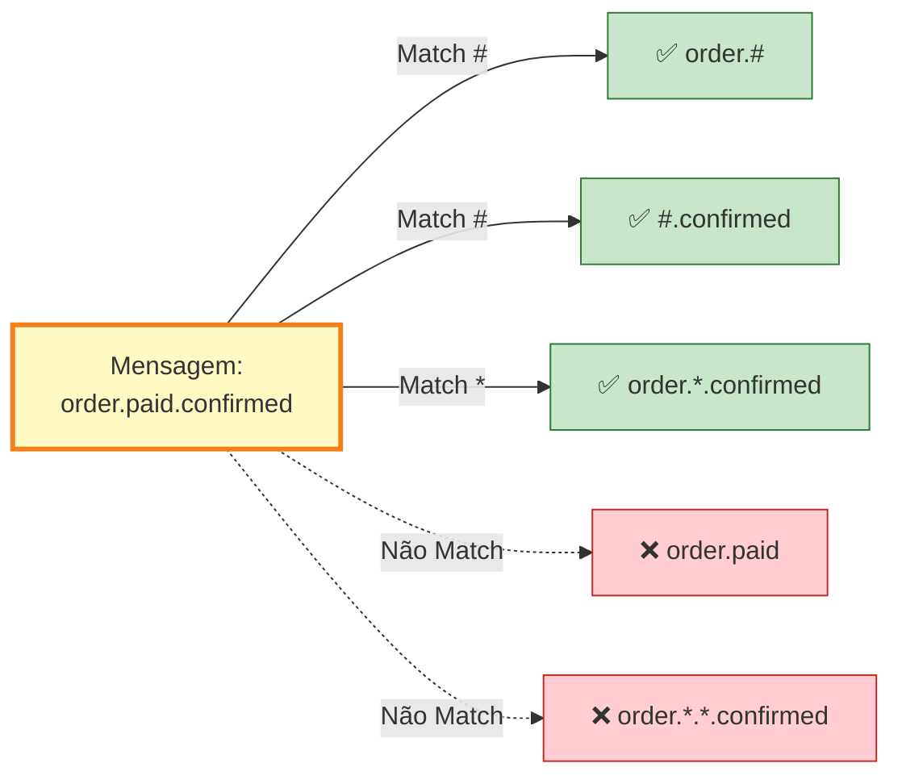

---

## Como Rodar

### Pré-requisitos

- **.NET 8 SDK**: [Download](https://dotnet.microsoft.com/download/dotnet/8.0)
- **RabbitMQ Server**: Pode ser instalado via Docker ou localmente

### Passo 1: Instalar RabbitMQ

#### Opção 1: Docker (Recomendado)

```bash
docker run -d --name rabbitmq \
  -p 5672:5672 \
  -p 15672:15672 \
  rabbitmq:3-management
```

- **Porta 5672**: Porta AMQP para conexão dos clientes
- **Porta 15672**: Interface web de gerenciamento

#### Opção 2: Instalação Local

- **Windows**: [Download RabbitMQ](https://www.rabbitmq.com/install-windows.html)
- **Linux**: `sudo apt-get install rabbitmq-server`
- **macOS**: `brew install rabbitmq`

### Passo 2: Clonar e Navegar até o Projeto

```bash
git clone https://github.com/brenoaug/rabbitmq-exercise.git
cd rabbitmq-exercise
git checkout exchange/topic
```

### Passo 3: Executar os Componentes

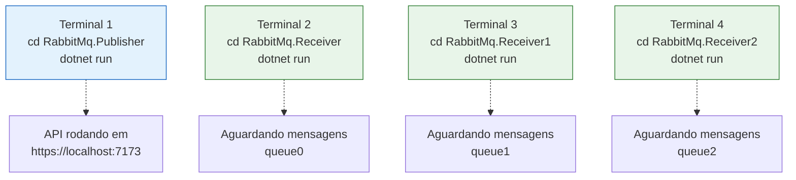

Abra **4 terminais** diferentes:

#### Terminal 1 - Publisher (API)

```bash
cd RabbitMq.Publisher
dotnet run
```

Acesse: `https://localhost:7173/swagger`

#### Terminal 2 - Receiver (queue0)

```bash
cd RabbitMq.Receiver
dotnet run
```

Saída esperada:
```
Fila queue0 vinculada ao exchange topic_exchange com routing key greeting.message
Aguardando mensagens. Pressione Ctrl+C para sair.
```

#### Terminal 3 - Receiver1 (queue1)

```bash
cd RabbitMq.Receiver1
dotnet run
```

Saída esperada:
```
Fila queue1 vinculada ao exchange topic_exchange com routing key bye.message
Aguardando mensagens. Pressione Ctrl+C para sair.
```

#### Terminal 4 - Receiver2 (queue2)

```bash
cd RabbitMq.Receiver2
dotnet run
```

Saída esperada:
```
Fila queue2 vinculada ao exchange topic_exchange com routing key *.message
Aguardando mensagens. Pressione Ctrl+C para sair.
```

### Passo 4: Enviar Mensagens

#### Via Swagger UI

1. Acesse `https://localhost:7173/swagger`
2. Expanda o endpoint `POST /Message/greeting`
3. Click em "Try it out"
4. Insira o JSON:

```json
{
  "title": "Olá",
  "text": "Bom dia a todos!",
  "author": "João Silva"
}
```

5. Click em "Execute"

#### Via cURL

**Enviar mensagem de saudação:**

```bash
curl -X POST https://localhost:7173/Message/greeting \
  -H "Content-Type: application/json" \
  -d '{
    "title": "Olá",
    "text": "Bom dia a todos!",
    "author": "João Silva"
  }'
```

**Enviar mensagem de despedida:**

```bash
curl -X POST https://localhost:7173/Message/bye \
  -H "Content-Type: application/json" \
  -d '{
    "title": "Tchau",
    "text": "Até logo!",
    "author": "Maria Santos"
  }'
```

### Passo 5: Verificar Resultados

#### Quando enviar `/greeting`:

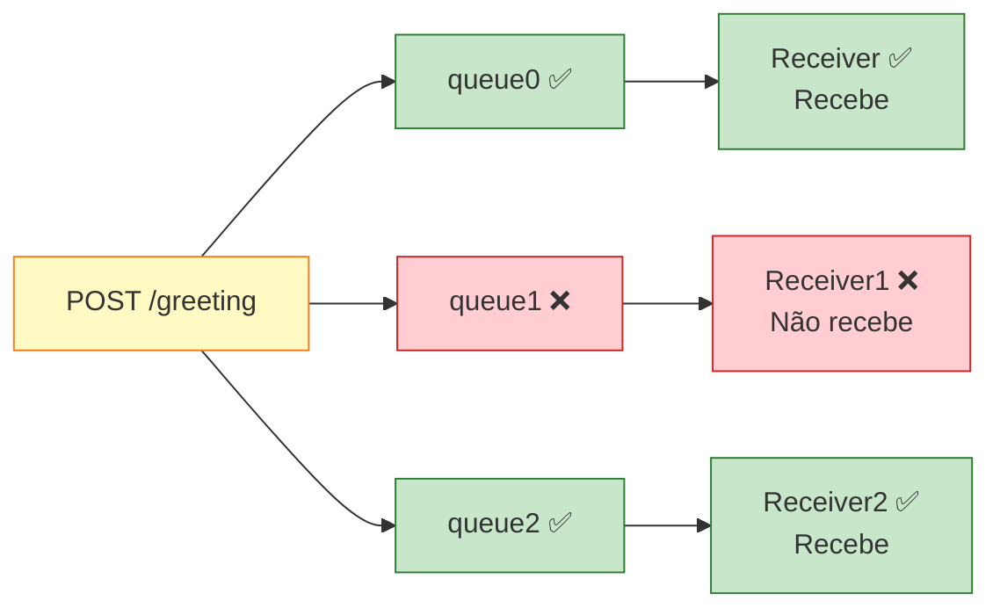

- **Terminal 2 (Receiver)**: ✅ Recebe a mensagem
- **Terminal 3 (Receiver1)**: ❌ Não recebe
- **Terminal 4 (Receiver2)**: ✅ Recebe a mensagem

#### Quando enviar `/bye`:

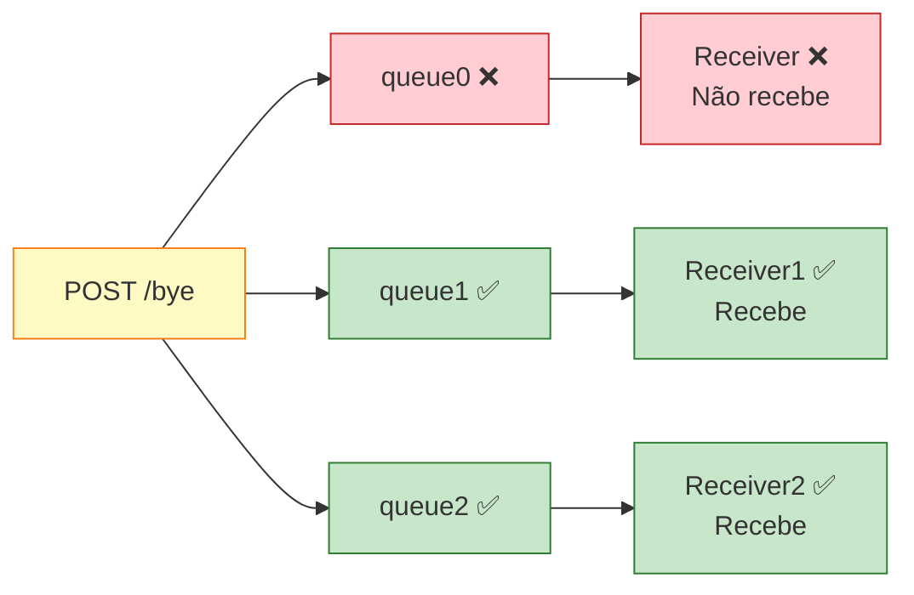

- **Terminal 2 (Receiver)**: ❌ Não recebe
- **Terminal 3 (Receiver1)**: ✅ Recebe a mensagem
- **Terminal 4 (Receiver2)**: ✅ Recebe a mensagem

---

## Estrutura do Projeto

```
rabbitmq-exercise/
│
├── RabbitMq.Publisher/              # API ASP.NET Core para publicar mensagens
│   ├── Controllers/
│   │   └── MessageController.cs     # Endpoints HTTP para envio de mensagens
│   ├── Services/
│   │   └── RabbitMqConfig.cs        # Configuração e setup do RabbitMQ
│   ├── Model/
│   │   └── Message.cs               # Modelo de dados da mensagem
│   └── Program.cs                   # Configuração da aplicação
│
├── RabbitMq.Receiver/               # Consumer 1 (queue0)
│   └── Program.cs                   # Consome mensagens com "greeting.message"
│
├── RabbitMq.Receiver1/              # Consumer 2 (queue1)
│   └── Program.cs                   # Consome mensagens com "bye.message"
│
└── RabbitMq.Receiver2/              # Consumer 3 (queue2)
    └── Program.cs                   # Consome TODAS as mensagens (*.message)
```

---

## Implementação Detalhada

### 1. Configuração do RabbitMQ (Publisher)

**Arquivo**: `RabbitMq.Publisher/Services/RabbitMqConfig.cs`

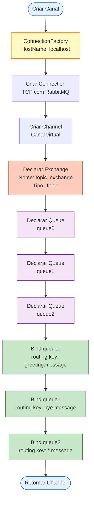

```csharp
using RabbitMQ.Client;

namespace RabbitMq.Publisher.Configuration
{
    public static class RabbitMqConfiguration
    {
        private const string HOST_NAME = "localhost";
        private const string EXCHANGE_NAME = "topic_exchange";

        public static async Task<IChannel> CreateAndConfigureChannelAsync()
        {
            // 1. Criar conexão com o RabbitMQ
            var factory = new ConnectionFactory() { HostName = HOST_NAME };
            var connection = await factory.CreateConnectionAsync();
            var channel = await connection.CreateChannelAsync();

            // 2. Declarar o Topic Exchange
            await channel.ExchangeDeclareAsync(
                exchange: EXCHANGE_NAME,
                type: ExchangeType.Topic,        // Define como Topic Exchange
                durable: false,                   // Não persiste após restart
                autoDelete: false,                // Não deleta automaticamente
                arguments: null);

            // 3. Declarar todas as filas
            await channel.QueueDeclareAsync(
                queue: "queue0",
                durable: false,
                exclusive: false,
                autoDelete: false,
                arguments: null);

            await channel.QueueDeclareAsync(
                queue: "queue1",
                durable: false,
                exclusive: false,
                autoDelete: false,
                arguments: null);

            await channel.QueueDeclareAsync(
                queue: "queue2",
                durable: false,
                exclusive: false,
                autoDelete: false,
                arguments: null);

            // 4. Fazer bind das filas ao exchange com routing keys específicas
            
            // queue0 recebe apenas mensagens com routing key exata "greeting.message"
            await channel.QueueBindAsync(
                queue: "queue0",
                exchange: EXCHANGE_NAME,
                routingKey: "greeting.message");

            // queue1 recebe apenas mensagens com routing key exata "bye.message"
            await channel.QueueBindAsync(
                queue: "queue1",
                exchange: EXCHANGE_NAME,
                routingKey: "bye.message");

            // queue2 recebe TODAS as mensagens que terminam com ".message"
            // O wildcard * substitui exatamente uma palavra
            await channel.QueueBindAsync(
                queue: "queue2",
                exchange: EXCHANGE_NAME,
                routingKey: "*.message");

            return channel;
        }

        public static async Task PublishMessageAsync(IChannel channel, string routingKey, byte[] body)
        {
            await channel.BasicPublishAsync(
                exchange: EXCHANGE_NAME,
                routingKey: routingKey,
                mandatory: false,
                body: body,
                cancellationToken: default);
        }
    }
}
```

#### Explicação dos Conceitos

**ConnectionFactory**: Fábrica responsável por criar conexões com o servidor RabbitMQ.

```csharp
var factory = new ConnectionFactory() { HostName = "localhost" };
```

**Connection**: Conexão TCP com o servidor RabbitMQ. É um recurso pesado que deve ser reutilizado.

```csharp
var connection = await factory.CreateConnectionAsync();
```

**Channel**: Canal de comunicação virtual dentro de uma conexão. Múltiplos channels podem compartilhar uma única conexão.

```csharp
var channel = await connection.CreateChannelAsync();
```

**ExchangeDeclareAsync**: Declara um exchange no RabbitMQ.

```csharp
await channel.ExchangeDeclareAsync(
    exchange: "topic_exchange",      // Nome do exchange
    type: ExchangeType.Topic,        // Tipo: Topic (usa padrões de routing)
    durable: false,                  // false = não sobrevive a restart do broker
    autoDelete: false,               // false = não deleta quando não há bindings
    arguments: null);                // Argumentos extras (não usados aqui)
```

**QueueDeclareAsync**: Declara uma fila no RabbitMQ.

```csharp
await channel.QueueDeclareAsync(
    queue: "queue0",                 // Nome da fila
    durable: false,                  // false = fila não persiste
    exclusive: false,                // false = outros canais podem acessar
    autoDelete: false,               // false = não deleta quando não há consumidores
    arguments: null);                // Argumentos extras
```

**QueueBindAsync**: Cria um binding entre exchange e fila com uma routing key.

```csharp
await channel.QueueBindAsync(
    queue: "queue0",                 // Nome da fila
    exchange: "topic_exchange",      // Nome do exchange
    routingKey: "greeting.message"); // Padrão de roteamento
```

---

### 2. Controller - Endpoints de Publicação

**Arquivo**: `RabbitMq.Publisher/Controllers/MessageController.cs`

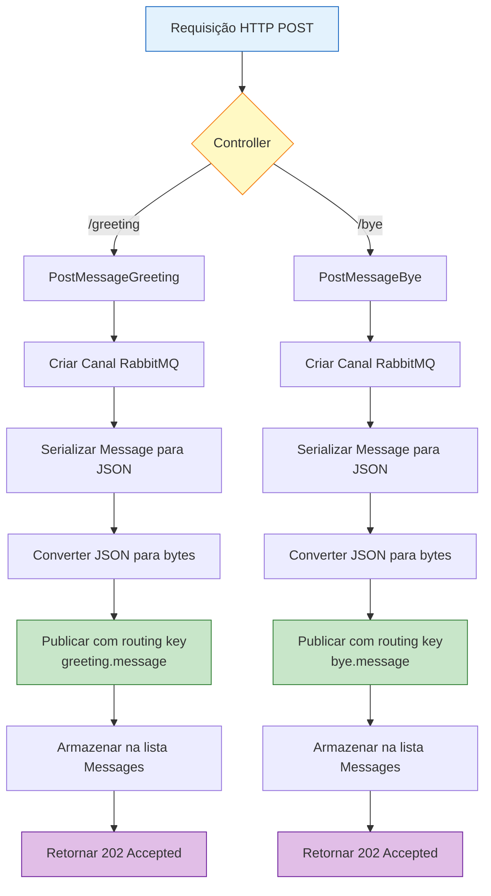

```csharp
using Microsoft.AspNetCore.Mvc;
using RabbitMq.Publisher.Configuration;
using RabbitMq.Publisher.Model;
using System.Text;
using System.Text.Json;

namespace RabbitMq.Publisher.Controllers
{
    [Route("[controller]")]
    [ApiController]
    public class MessageController : ControllerBase
    {
        // Lista em memória para armazenar histórico de mensagens enviadas
        private static List<Message> Messages = new List<Message>();

        // Endpoint GET para recuperar todas as mensagens enviadas
        [HttpGet]
        public async Task<IEnumerable<Message>> GetMessage()
        {
            return Messages;
        }

        // Endpoint POST para enviar mensagens de saudação
        [HttpPost("greeting")]
        public async Task<IActionResult> PostMessageGreeting([FromBody] Message message)
        {
            // 1. Criar e configurar canal RabbitMQ
            using var channel = await RabbitMqConfiguration.CreateAndConfigureChannelAsync();

            // 2. Serializar mensagem para JSON e converter para bytes
            var body = Encoding.UTF8.GetBytes(JsonSerializer.Serialize(message));

            // 3. Publicar no exchange com routing key "greeting.message"
            await RabbitMqConfiguration.PublishMessageAsync(channel, "greeting.message", body);

            // 4. Armazenar mensagem localmente e retornar resposta
            Messages.Add(message);
            return Accepted(new { status = "Mensagem de saudação enviada", message });
        }

        // Endpoint POST para enviar mensagens de despedida
        [HttpPost("bye")]
        public async Task<IActionResult> PostMessageBye([FromBody] Message message)
        {
            // 1. Criar e configurar canal RabbitMQ
            using var channel = await RabbitMqConfiguration.CreateAndConfigureChannelAsync();

            // 2. Serializar mensagem para JSON e converter para bytes
            var body = Encoding.UTF8.GetBytes(JsonSerializer.Serialize(message));

            // 3. Publicar no exchange com routing key "bye.message"
            await RabbitMqConfiguration.PublishMessageAsync(channel, "bye.message", body);

            // 4. Armazenar mensagem localmente e retornar resposta
            Messages.Add(message);
            return Accepted(new { status = "Mensagem de despedida enviada", message });
        }
    }
}
```

#### Explicação do Fluxo

1. **Recebimento da Requisição**: Controller recebe uma requisição HTTP POST com JSON no body
2. **Criação do Canal**: Estabelece conexão e configura exchange, filas e bindings
3. **Serialização**: Converte objeto `Message` para JSON e depois para array de bytes
4. **Publicação**: Envia bytes para o exchange com a routing key específica
5. **Armazenamento**: Guarda mensagem na lista local (para fins de histórico/debug)
6. **Resposta**: Retorna status HTTP 202 Accepted com confirmação

---

### 3. Consumidor - Receiver (queue0)

**Arquivo**: `RabbitMq.Receiver/Program.cs`

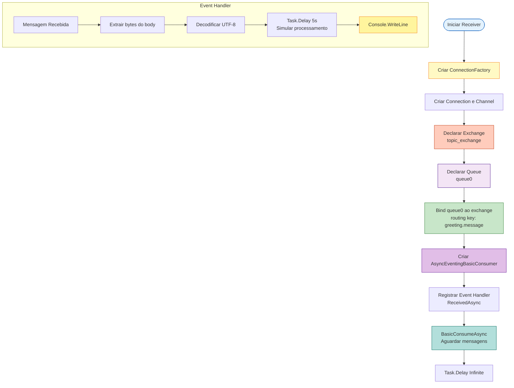

```csharp
using RabbitMQ.Client;
using RabbitMQ.Client.Events;
using System.Text;

Console.OutputEncoding = Encoding.UTF8;

// Configurações do consumidor
const string QUEUE_NAME = "queue0";
const string EXCHANGE_NAME = "topic_exchange";
const string ROUTING_KEY = "greeting.message";

// 1. Estabelecer conexão com RabbitMQ
var factory = new ConnectionFactory { HostName = "localhost" };
using var connection = await factory.CreateConnectionAsync();
using var channel = await connection.CreateChannelAsync();

// 2. Declarar o exchange (garante que existe)
await channel.ExchangeDeclareAsync(
    exchange: EXCHANGE_NAME,
    type: ExchangeType.Topic);

// 3. Declarar a fila (garante que existe)
await channel.QueueDeclareAsync(
    queue: QUEUE_NAME,
    durable: false,
    exclusive: false,
    autoDelete: false);

// 4. Fazer bind da fila ao exchange com routing key específica
await channel.QueueBindAsync(
    queue: QUEUE_NAME,
    exchange: EXCHANGE_NAME,
    routingKey: ROUTING_KEY);

Console.WriteLine($"Fila {QUEUE_NAME} vinculada ao exchange {EXCHANGE_NAME} com routing key {ROUTING_KEY}");

// 5. Configurar consumidor assíncrono
var consumer = new AsyncEventingBasicConsumer(channel);
consumer.ReceivedAsync += async (model, ea) =>
{
    // Extrair corpo da mensagem
    var body = ea.Body.ToArray();
    var message = Encoding.UTF8.GetString(body);

    // Simular processamento demorado (5 segundos)
    await Task.Delay(5000);

    // Exibir mensagem processada
    Console.WriteLine($"Mensagem Recebida: {message}");
};

// 6. Iniciar consumo de mensagens
await channel.BasicConsumeAsync(
    QUEUE_NAME,
    autoAck: true,        // Acknowledgment automático
    consumer: consumer);

Console.WriteLine("Aguardando mensagens. Pressione Ctrl+C para sair.");
await Task.Delay(Timeout.Infinite);
```

#### Explicação do Fluxo do Consumidor

1. **Conexão**: Estabelece conexão TCP com o servidor RabbitMQ
2. **Declaração**: Declara exchange e fila (se já existirem, apenas confirma)
3. **Binding**: Vincula a fila ao exchange com routing key "greeting.message"
4. **Consumidor Assíncrono**: Cria um consumidor que processa mensagens de forma assíncrona
5. **Event Handler**: Define o que fazer quando uma mensagem chegar
6. **Processamento**: Simula trabalho pesado com delay de 5 segundos
7. **AutoAck**: Confirma automaticamente o recebimento da mensagem

---

### 4. Consumidor - Receiver1 (queue1)

**Arquivo**: `RabbitMq.Receiver1/Program.cs`

```csharp
using RabbitMQ.Client;
using RabbitMQ.Client.Events;
using System.Text;

Console.OutputEncoding = Encoding.UTF8;

const string QUEUE_NAME = "queue1";
const string EXCHANGE_NAME = "topic_exchange";
const string ROUTING_KEY = "bye.message";

var factory = new ConnectionFactory { HostName = "localhost" };
using var connection = await factory.CreateConnectionAsync();
using var channel = await connection.CreateChannelAsync();

await channel.ExchangeDeclareAsync(
    exchange: EXCHANGE_NAME,
    type: ExchangeType.Topic);

await channel.QueueDeclareAsync(
    queue: QUEUE_NAME,
    durable: false,
    exclusive: false,
    autoDelete: false);

await channel.QueueBindAsync(
    queue: QUEUE_NAME,
    exchange: EXCHANGE_NAME,
    routingKey: ROUTING_KEY);

Console.WriteLine($"Fila {QUEUE_NAME} vinculada ao exchange {EXCHANGE_NAME} com routing key {ROUTING_KEY}");

var consumer = new AsyncEventingBasicConsumer(channel);
consumer.ReceivedAsync += async (model, ea) =>
{
    var body = ea.Body.ToArray();
    var message = Encoding.UTF8.GetString(body);
    await Task.Delay(5000);
    Console.WriteLine($"Mensagem Recebida: {message}");
};

await channel.BasicConsumeAsync(
    QUEUE_NAME,
    autoAck: true,
    consumer: consumer);

Console.WriteLine("Aguardando mensagens. Pressione Ctrl+C para sair.");
await Task.Delay(Timeout.Infinite);
```

**Diferença**: Este consumidor está vinculado à `queue1` com routing key `"bye.message"`, então só recebe mensagens de despedida.

---

### 5. Consumidor - Receiver2 (queue2)

**Arquivo**: `RabbitMq.Receiver2/Program.cs`

```csharp
using RabbitMQ.Client;
using RabbitMQ.Client.Events;
using System.Text;

Console.OutputEncoding = Encoding.UTF8;

const string QUEUE_NAME = "queue2";
const string EXCHANGE_NAME = "topic_exchange";
const string ROUTING_KEY = "*.message";  // WILDCARD: recebe TODAS

var factory = new ConnectionFactory { HostName = "localhost" };
using var connection = await factory.CreateConnectionAsync();
using var channel = await connection.CreateChannelAsync();

await channel.ExchangeDeclareAsync(
    exchange: EXCHANGE_NAME,
    type: ExchangeType.Topic);

await channel.QueueDeclareAsync(
    queue: QUEUE_NAME,
    durable: false,
    exclusive: false,
    autoDelete: false);

await channel.QueueBindAsync(
    queue: QUEUE_NAME,
    exchange: EXCHANGE_NAME,
    routingKey: ROUTING_KEY);

Console.WriteLine($"Fila {QUEUE_NAME} vinculada ao exchange {EXCHANGE_NAME} com routing key {ROUTING_KEY}");

var consumer = new AsyncEventingBasicConsumer(channel);
consumer.ReceivedAsync += async (model, ea) =>
{
    var body = ea.Body.ToArray();
    var message = Encoding.UTF8.GetString(body);
    await Task.Delay(5000);
    Console.WriteLine($"Mensagem Recebida: {message}");
};

await channel.BasicConsumeAsync(
    QUEUE_NAME,
    autoAck: true,
    consumer: consumer);

Console.WriteLine("Aguardando mensagens. Pressione Ctrl+C para sair.");
await Task.Delay(Timeout.Infinite);
```

**Diferença Importante**: Este consumidor usa o wildcard `"*.message"` como routing key, o que significa que receberá **QUALQUER** mensagem cuja routing key tenha exatamente uma palavra seguida de `.message` (como `greeting.message` ou `bye.message`).

---

## Comparação: Direct vs Fanout vs Topic Exchange

```mermaid
graph TB
    subgraph "Direct Exchange"
        D1[Mensagem com<br/>routing key: order.paid]
        D2[Exchange: Direct]
        D3[Queue com binding<br/>order.paid]
        D4[❌ Queue com binding<br/>order.shipped]
        
        D1 --> D2
        D2 -->|Match exato| D3
        D2 -.->|Não match| D4
    end
    
    subgraph "Fanout Exchange"
        F1[Mensagem com<br/>qualquer routing key]
        F2[Exchange: Fanout]
        F3[Queue 1]
        F4[Queue 2]
        F5[Queue 3]
        
        F1 --> F2
        F2 -->|Ignora routing key| F3
        F2 -->|Envia para TODAS| F4
        F2 -->|as filas| F5
    end
    
    subgraph "Topic Exchange"
        T1[Mensagem com<br/>routing key: order.paid.email]
        T2[Exchange: Topic]
        T3[✅ Queue: order.#]
        T4[✅ Queue: #.email]
        T5[❌ Queue: order.paid]
        
        T1 --> T2
        T2 -->|Match wildcard| T3
        T2 -->|Match wildcard| T4
        T2 -.->|Não match| T5
    end
    
    style D1 fill:#fff9c4,stroke:#f57f17
    style F1 fill:#fff9c4,stroke:#f57f17
    style T1 fill:#fff9c4,stroke:#f57f17
    style D2 fill:#ffccbc,stroke:#bf360c
    style F2 fill:#ffccbc,stroke:#bf360c
    style T2 fill:#ffccbc,stroke:#bf360c
    style D3 fill:#c8e6c9,stroke:#2e7d32
    style D4 fill:#ffcdd2,stroke:#c62828
    style T3 fill:#c8e6c9,stroke:#2e7d32
    style T4 fill:#c8e6c9,stroke:#2e7d32
    style T5 fill:#ffcdd2,stroke:#c62828
```

### Tabela Comparativa

| Característica | Direct Exchange | Fanout Exchange | Topic Exchange |
|----------------|----------------|-----------------|----------------|
| **Roteamento** | Routing key exata | Ignora routing key | Padrões com wildcards |
| **Uso** | Roteamento simples 1:1 | Broadcasting | Roteamento complexo |
| **Flexibilidade** | Baixa | Nenhuma | Alta |
| **Performance** | Rápida | Mais rápida | Moderada |
| **Caso de Uso** | Fila de pedidos | Notificações globais | Logs por severidade |

### Quando Usar Topic Exchange?

✅ **Use Topic Exchange quando:**
- Precisa de roteamento baseado em múltiplos critérios
- Quer que consumidores escolham padrões de mensagens
- Sistema de logs com níveis (`error.#`, `*.warning`, etc.)
- Mensagens categorizadas hierarquicamente (`order.paid.email`, `order.canceled.sms`)

❌ **Não use Topic Exchange quando:**
- Roteamento simples 1:1 é suficiente → Use Direct Exchange
- Precisa enviar para todos → Use Fanout Exchange
- Performance é crítica e padrões não são necessários

---

## Exemplos de Uso

### 1. Enviar Greeting

**cURL:**
```bash
curl -X POST https://localhost:7173/Message/greeting \
  -H "Content-Type: application/json" \
  -d '{"title":"Olá","text":"Mundo","author":"João"}'
```

**Resultado:**
- Receiver (queue0): Recebe
- Receiver2 (queue2): Recebe
- Receiver1 (queue1): Não recebe

### 2. Enviar Bye

**cURL:**
```bash
curl -X POST https://localhost:7173/Message/bye \
  -H "Content-Type: application/json" \
  -d '{"title":"Tchau","text":"Até","author":"Maria"}'
```

**Resultado:**
- Receiver (queue0): Não recebe
- Receiver1 (queue1): Recebe
- Receiver2 (queue2): Recebe

---

## Interface de Gerenciamento RabbitMQ

Acesse `http://localhost:15672` (credenciais padrão: `guest` / `guest`)

### Visualizações Disponíveis

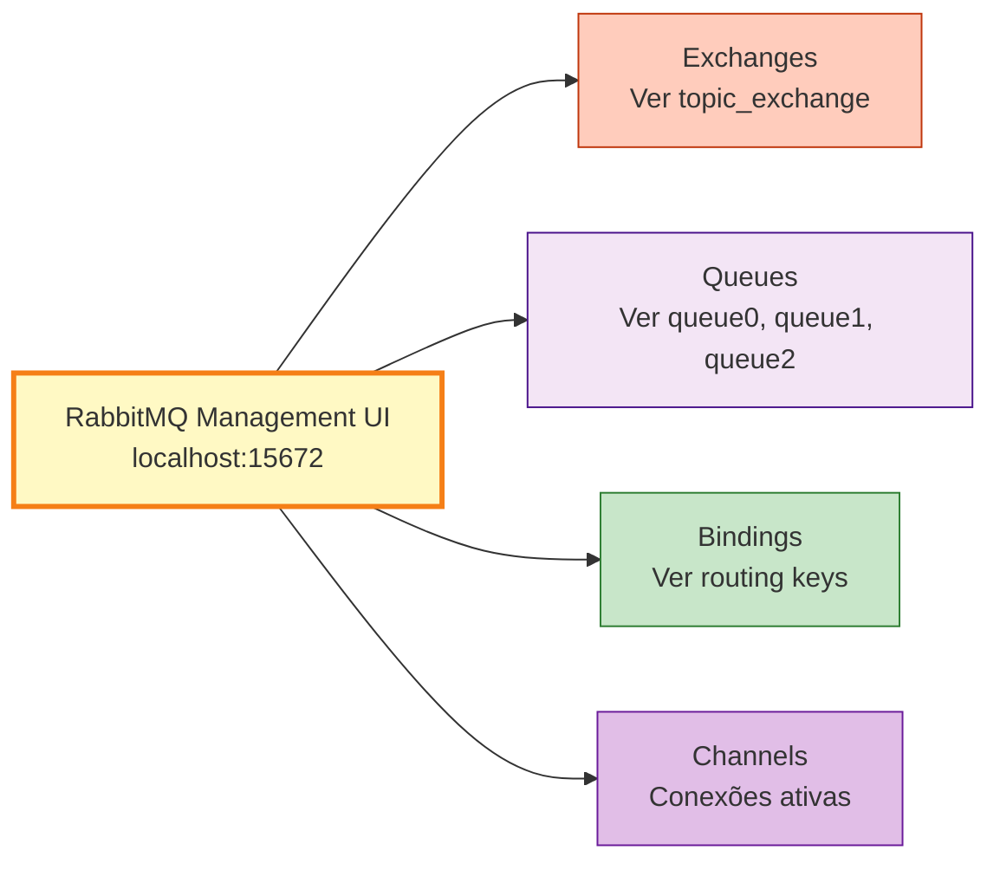

### Visualizar Exchanges

1. Click em **Exchanges**
2. Encontre `topic_exchange`
3. Veja o tipo: **topic**

### Visualizar Filas

1. Click em **Queues**
2. Veja as filas: `queue0`, `queue1`, `queue2`
3. Check se há mensagens pendentes

### Visualizar Bindings

1. Click em **Exchanges** → `topic_exchange`
2. Scroll até **Bindings**
3. Veja as routing keys:
   - `queue0` ← `greeting.message`
   - `queue1` ← `bye.message`
   - `queue2` ← `*.message`

---

## Referência de APIs

### ConnectionFactory

```csharp
var factory = new ConnectionFactory
{
    HostName = "localhost",
    Port = 5672,
    UserName = "guest",
    Password = "guest"
};
var connection = await factory.CreateConnectionAsync();
```

### Exchange Operations

```csharp
await channel.ExchangeDeclareAsync(
    exchange: "topic_exchange",
    type: ExchangeType.Topic,
    durable: false,
    autoDelete: false
);
```

### Queue Operations

```csharp
await channel.QueueDeclareAsync(
    queue: "my_queue",
    durable: false,
    exclusive: false,
    autoDelete: false
);
```

### Binding Operations

```csharp
await channel.QueueBindAsync(
    queue: "my_queue",
    exchange: "my_exchange",
    routingKey: "my.routing.key"
);
```

### Publish Operations

```csharp
await channel.BasicPublishAsync(
    exchange: "my_exchange",
    routingKey: "my.routing.key",
    body: messageBytes
);
```

### Consume Operations

```csharp
var consumer = new AsyncEventingBasicConsumer(channel);
consumer.ReceivedAsync += async (sender, ea) =>
{
    var message = Encoding.UTF8.GetString(ea.Body.ToArray());
    Console.WriteLine($"Recebido: {message}");
};

await channel.BasicConsumeAsync(
    queue: "my_queue",
    autoAck: true,
    consumer: consumer
);
```

---

## Troubleshooting

### Connection refused

**Problema:** RabbitMQ não está rodando

**Solução:**
```bash
docker start rabbitmq
# ou
sudo systemctl start rabbitmq-server
```

### Mensagens não chegam

**Checklist:**
1. RabbitMQ rodando?
2. Receivers executando?
3. Routing keys corretas?
4. Verificar http://localhost:15672

### Caracteres estranhos

**Problema:** Encoding incorreto

**Solução:**
```csharp
Console.OutputEncoding = Encoding.UTF8;
```

---

## Best Practices

### DO (Recomendado)

```csharp
// Use async/await
await channel.BasicPublishAsync(...);

// Configure UTF-8
Console.OutputEncoding = Encoding.UTF8;

// Use using
using var connection = await factory.CreateConnectionAsync();

// Log erros
try { ... } catch (Exception ex) { logger.LogError(ex, "..."); }
```

### DON'T (Evitar)

```csharp
// Não use Thread.Sleep em async
// ERRADO: Thread.Sleep(5000);
// CORRETO: await Task.Delay(5000;

// Não ignore exceções
// ERRADO: try { ... } catch { }

// Não crie conexão por mensagem
// Reutilize conexões
```

---

## Conceitos Avançados

### Dead Letter Exchange (DLX)

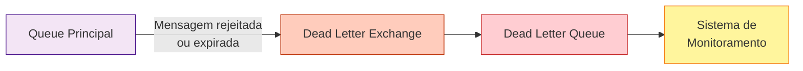

Filas podem ter um exchange alternativo para mensagens rejeitadas ou expiradas:

```csharp
var args = new Dictionary<string, object>
{
    { "x-dead-letter-exchange", "dlx_exchange" },
    { "x-dead-letter-routing-key", "dead.letter" }
};

await channel.QueueDeclareAsync(
    queue: "my_queue",
    durable: true,
    exclusive: false,
    autoDelete: false,
    arguments: args);
```

### Message TTL (Time To Live)

Definir tempo de expiração para mensagens:

```csharp
var properties = new BasicProperties
{
    Expiration = "60000" // 60 segundos
};

await channel.BasicPublishAsync(
    exchange: "topic_exchange",
    routingKey: "greeting.message",
    mandatory: false,
    basicProperties: properties,
    body: body);
```

### Prefetch Count

Limitar quantas mensagens não confirmadas um consumer pode ter:

```csharp
await channel.BasicQosAsync(
    prefetchSize: 0,
    prefetchCount: 1,  // Processar 1 mensagem por vez
    global: false);
```

---

## Glossário

| Termo | Definição |
|-------|-----------|
| **AMQP** | Advanced Message Queuing Protocol - protocolo usado pelo RabbitMQ |
| **Binding** | Ligação entre exchange e fila com uma routing key |
| **Broker** | Servidor intermediário que gerencia mensagens (RabbitMQ) |
| **Channel** | Conexão virtual leve dentro de uma conexão TCP |
| **Consumer** | Aplicação que recebe mensagens de uma fila |
| **Exchange** | Componente que recebe mensagens e roteia para filas |
| **Producer** | Aplicação que envia mensagens para um exchange |
| **Queue** | Fila que armazena mensagens até serem consumidas |
| **Routing Key** | Chave usada pelo exchange para decidir o roteamento |
| **Wildcard** | Caractere especial (`*` ou `#`) usado em padrões de routing |

---

## Recursos Adicionais

### Documentação Oficial

- [RabbitMQ Tutorials](https://www.rabbitmq.com/getstarted.html)
- [RabbitMQ .NET Client Guide](https://www.rabbitmq.com/dotnet-api-guide.html)
- [Topic Exchange Tutorial](https://www.rabbitmq.com/tutorials/tutorial-five-dotnet.html)

### Ferramentas

- [RabbitMQ Management UI](http://localhost:15672) - Interface web para gerenciar RabbitMQ
- [RabbitMQ Simulator](http://tryrabbitmq.com/) - Simulador online para testar conceitos

### Comandos Úteis

```bash
# Docker
docker start rabbitmq
docker stop rabbitmq
docker logs -f rabbitmq
docker exec -it rabbitmq rabbitmqctl status

# RabbitMQCtl (se instalado localmente)
rabbitmqctl list_queues
rabbitmqctl list_exchanges
rabbitmqctl list_bindings
rabbitmqctl purge_queue queue0
```

---

## Próximos Passos

Após dominar o Topic Exchange, explore:

1. **Headers Exchange**: Roteamento baseado em headers de mensagens
2. **Dead Letter Queues**: Tratamento de mensagens falhas
3. **Message Priority**: Priorização de mensagens
4. **Clustering**: RabbitMQ em alta disponibilidade
5. **Federation e Shovel**: Distribuição de mensagens entre brokers

---

## Licença

Este projeto é um exemplo educacional para demonstração de conceitos de mensageria com RabbitMQ.

---

**Desenvolvido para fins de aprendizado e demonstração de conceitos de arquitetura distribuída.**
