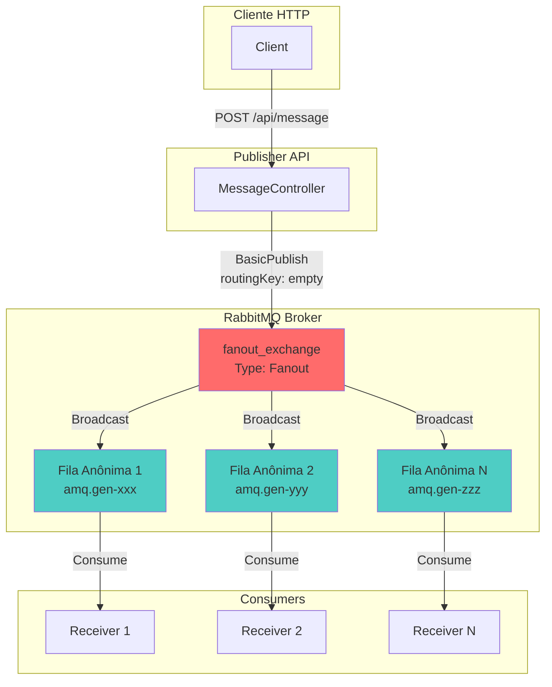
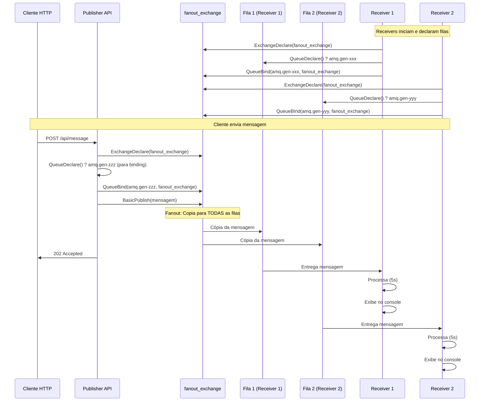
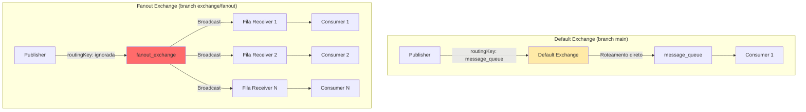
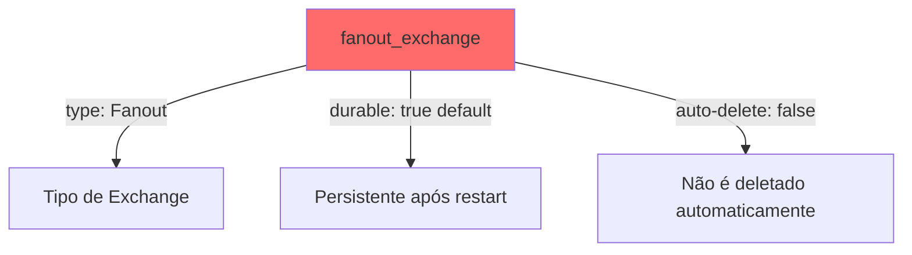
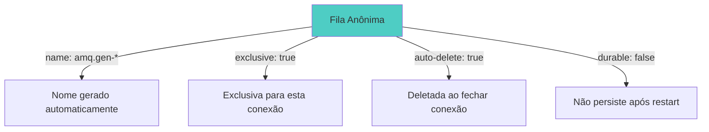
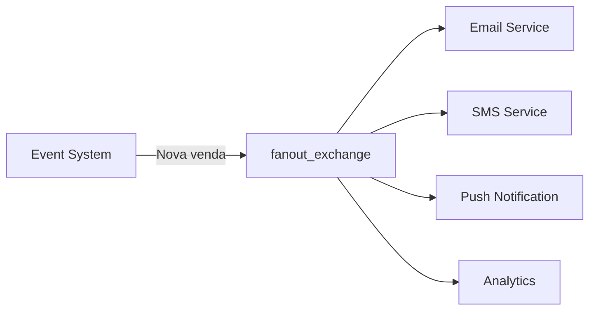
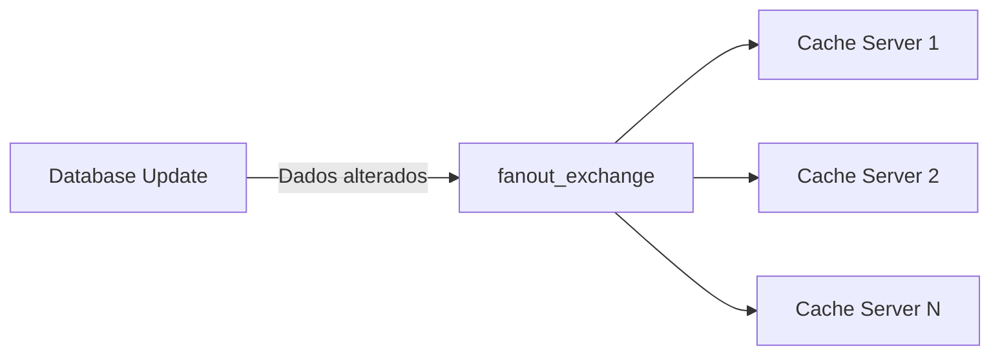
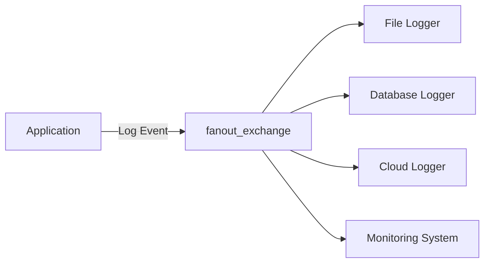
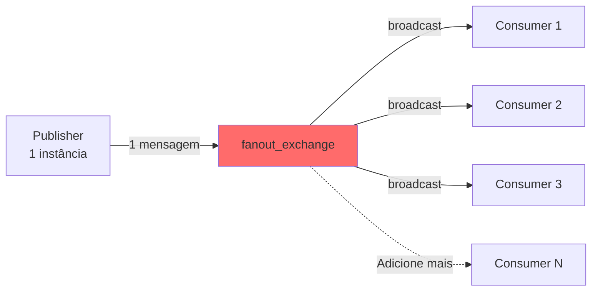
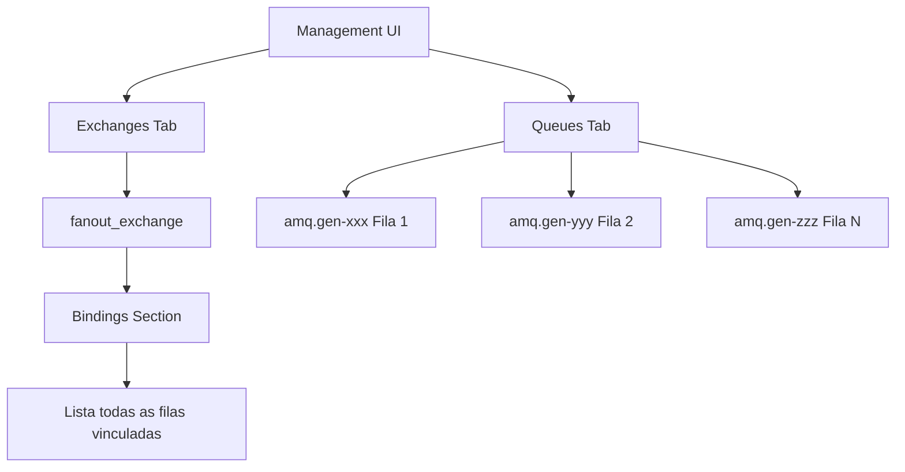

# Sistema de Mensageria com RabbitMQ - Fanout Exchange

## Visão Geral

Esta branch (`exchange/fanout`) demonstra a implementação de um sistema de mensageria assíncrona utilizando RabbitMQ com **Fanout Exchange**. Este tipo de exchange implementa o padrão de broadcasting, onde uma única mensagem é distribuída para **todas as filas vinculadas**, independentemente de routing keys.

## O que é Fanout Exchange?

O **Fanout Exchange** é o tipo mais simples de exchange no RabbitMQ. Ele funciona como um broadcast: toda mensagem publicada é copiada e enviada para **todas as filas** que estão vinculadas (bound) a este exchange, ignorando completamente a routing key.

### Características do Fanout Exchange

| Característica | Comportamento |
|----------------|---------------|
| **Routing Key** | Completamente ignorada - pode ser vazia |
| **Distribuição** | Broadcast para todas as filas vinculadas |
| **Uso típico** | Notificações globais, eventos de sistema, cache invalidation |
| **Performance** | Mais rápido que outros tipos (não precisa analisar routing key) |
| **Flexibilidade** | Adicionar/remover consumidores não afeta o publisher |

## Arquitetura do Sistema



## Estrutura do Projeto

```
rabbitmq-exercise/ (branch: exchange/fanout)
??? RabbitMq.Publisher/
?   ??? Controllers/
?   ?   ??? MessageController.cs  # Publica no fanout_exchange
?   ??? Model/
?   ?   ??? Message.cs            # Modelo da mensagem
?   ??? Program.cs                # Configuração da API
?
??? RabbitMq.Receiver/
    ??? Program.cs                # Consumer com fila anônima
```

## Implementação Detalhada

### Publisher (MessageController.cs)

O Publisher é responsável por enviar mensagens para o Fanout Exchange.

#### Passo 1: Declarar Fila Anônima

```csharp
// Cria uma fila com nome gerado automaticamente pelo RabbitMQ
QueueDeclareOk queueDeclareResult = await channel.QueueDeclareAsync();
string queueName = queueDeclareResult.QueueName;
// Exemplo de nome gerado: amq.gen-JzTY20BRgKO-HjmUJj0wLg
```

**Por que fila anônima?**
- Nome gerado automaticamente pelo RabbitMQ (prefixo `amq.gen-`)
- Exclusiva para esta conexão
- Deletada automaticamente quando a conexão fecha
- Ideal para consumers temporários ou múltiplos consumers independentes

#### Passo 2: Declarar o Exchange

```csharp
await channel.ExchangeDeclareAsync(
    exchange: "fanout_exchange",
    type: ExchangeType.Fanout);
```

| Parâmetro | Valor | Significado |
|-----------|-------|-------------|
| **exchange** | "fanout_exchange" | Nome identificador do exchange |
| **type** | ExchangeType.Fanout | Tipo de roteamento (broadcast) |

#### Passo 3: Vincular Fila ao Exchange (Binding)

```csharp
await channel.QueueBindAsync(
    queue: queueName,
    exchange: "fanout_exchange",
    routingKey: string.Empty,  // Ignorada no Fanout
    arguments: null);
```

**Binding no Fanout:**
- Cria vínculo entre a fila e o exchange
- `routingKey` pode ser vazia - será ignorada
- Toda mensagem publicada no exchange será copiada para esta fila

#### Passo 4: Publicar Mensagem

```csharp
var body = Encoding.UTF8.GetBytes(JsonSerializer.Serialize(message));

await channel.BasicPublishAsync(
    exchange: "fanout_exchange",  // Publica no exchange, não diretamente na fila
    routingKey: string.Empty,     // Ignorada no Fanout
    mandatory: false,
    body: body,
    cancellationToken: default);
```

### Receiver (Program.cs)

O Receiver se conecta ao exchange e consome mensagens de uma fila anônima.

#### Passo 1: Declarar o Exchange

```csharp
await channel.ExchangeDeclareAsync(
    exchange: "fanout_exchange",
    type: ExchangeType.Fanout);
```

**Importante:** O exchange deve ser declarado tanto no Publisher quanto no Receiver. Se já existir, a declaração é idempotente (não causa erro).

#### Passo 2: Criar Fila Anônima

```csharp
QueueDeclareOk queueDeclareResult = await channel.QueueDeclareAsync();
string queueName = queueDeclareResult.QueueName;
```

**Cada Receiver tem sua própria fila:**
- Se você executar 3 Receivers, serão criadas 3 filas anônimas
- Cada fila receberá uma cópia da mensagem
- Filas são independentes entre si

#### Passo 3: Fazer Binding

```csharp
await channel.QueueBindAsync(
    queue: queueName,
    exchange: "fanout_exchange",
    routingKey: string.Empty,
    arguments: null);
```

#### Passo 4: Consumir Mensagens

```csharp
var consumer = new AsyncEventingBasicConsumer(channel);
consumer.ReceivedAsync += (model, ea) =>
{
    var body = ea.Body.ToArray();
    var message = Encoding.UTF8.GetString(body);
    Thread.Sleep(5000);  // Simula processamento
    Console.WriteLine($" Mensagem Recebida {message}");
    return Task.CompletedTask;
};

await channel.BasicConsumeAsync(queueName, autoAck: true, consumer: consumer);
```

## Fluxo Completo de Mensagens



## Diferença entre Fanout e Default Exchange



### Comparação

| Aspecto | Default Exchange | Fanout Exchange |
|---------|-----------------|-----------------|
| **Routing Key** | Obrigatória (nome da fila) | Ignorada |
| **Destinatários** | Uma única fila | Todas as filas vinculadas |
| **Uso** | Point-to-point | Broadcast |
| **Escalabilidade** | Load balancing entre consumers da mesma fila | Cópia para cada consumer |

## Componentes do Sistema

### 1. RabbitMq.Publisher (Produtor)

API REST desenvolvida em ASP.NET Core 8.0 que publica mensagens no Fanout Exchange.

#### Endpoints Disponíveis

**GET /api/message**
- Retorna todas as mensagens publicadas armazenadas em memória
- Resposta: Lista de mensagens

**POST /api/message**
- Publica uma nova mensagem no fanout_exchange
- Body: JSON com estrutura da mensagem
- Resposta: Status 202 (Accepted) com confirmação

#### Modelo de Mensagem

```json
{
  "title": "string",
  "text": "string",
  "author": "string"
}
```

### 2. RabbitMq.Receiver (Consumidor)

Aplicação console que:
- Declara o fanout_exchange
- Cria uma fila anônima exclusiva
- Vincula a fila ao exchange
- Consome mensagens broadcast

#### Comportamento

- Conecta-se automaticamente ao RabbitMQ no localhost
- Cria fila com nome gerado automaticamente (ex: `amq.gen-JzTY20BRgKO`)
- Recebe **todas** as mensagens publicadas no fanout_exchange
- Processa cada mensagem com delay de 5 segundos (simulação)
- Exibe a mensagem no console após processamento

## Configuração do Exchange e Filas

### Fanout Exchange



### Filas Anônimas



### Propriedades das Filas

| Propriedade | Valor | Significado |
|-------------|-------|-------------|
| **name** | `amq.gen-*` | Nome gerado automaticamente pelo RabbitMQ |
| **durable** | false | Fila não sobrevive ao restart do RabbitMQ |
| **exclusive** | true | Apenas esta conexão pode acessar a fila |
| **auto-delete** | true | Fila é deletada quando a conexão fecha |
| **autoAck** | true | Mensagens são automaticamente confirmadas |

## Casos de Uso do Fanout Exchange

### 1. Notificações em Tempo Real



**Exemplo prático:**
- Sistema de e-commerce registra uma venda
- Notificação enviada para: Email, SMS, App Mobile, Dashboard Analytics

### 2. Cache Invalidation



**Exemplo prático:**
- Produto atualizado no banco de dados
- Todos os servidores de cache invalidam o cache deste produto

### 3. Logging Distribuído



**Exemplo prático:**
- Aplicação gera um log de erro crítico
- Log é enviado para: arquivo local, banco de dados, cloud storage, sistema de monitoramento

## Testando Múltiplos Consumers

Para ver o poder do Fanout Exchange, execute múltiplos Receivers:

### Terminal 1 - Publisher
```bash
cd RabbitMq.Publisher
dotnet run
```

### Terminal 2 - Receiver 1
```bash
cd RabbitMq.Receiver
dotnet run
```

### Terminal 3 - Receiver 2
```bash
cd RabbitMq.Receiver
dotnet run
```

### Terminal 4 - Receiver 3
```bash
cd RabbitMq.Receiver
dotnet run
```

### Enviar Mensagem

Use Swagger (https://localhost:7xxx/swagger) ou cURL:

```bash
curl -X POST "https://localhost:7xxx/api/message" \
  -H "Content-Type: application/json" \
  -d '{
    "title": "Broadcast Test",
    "text": "Esta mensagem chegará em TODOS os receivers",
    "author": "System"
  }'
```

### Resultado Esperado

**Todos os 3 receivers** exibirão (após 5 segundos):
```
Mensagem Recebida {"Title":"Broadcast Test","Text":"Esta mensagem chegará em TODOS os receivers","Author":"System"}
```

## Vantagens do Fanout Exchange

### 1. Simplicidade
- Não precisa configurar routing keys
- Lógica de roteamento transparente
- Fácil adicionar ou remover consumers

### 2. Desacoplamento Total
- Publisher não conhece os consumers
- Consumers não conhecem outros consumers
- Adicionar novo consumer não requer mudanças no publisher

### 3. Escalabilidade Horizontal


### 4. Processamento Paralelo Independente
- Cada consumer processa em seu próprio ritmo
- Falha em um consumer não afeta os outros
- Ideal para tarefas independentes (email, SMS, analytics)

## Quando NÃO Usar Fanout

? **Não use Fanout quando:**

1. **Precisa de roteamento seletivo**
   - Use Direct ou Topic Exchange se precisar enviar mensagens apenas para alguns consumers

2. **Load Balancing**
   - Se quer distribuir mensagens entre workers (não copiar), use uma única fila com múltiplos consumers

3. **Volume muito alto**
   - Se tem milhares de consumers, cada mensagem será copiada milhares de vezes

4. **Processamento sequencial**
   - Fanout é para processamento paralelo e independente

## Monitoramento

### Management UI do RabbitMQ

Acesse http://localhost:15672 para visualizar:

#### Exchanges
- Nome: `fanout_exchange`
- Tipo: `fanout`
- Bindings: Todas as filas vinculadas

#### Queues
- Filas anônimas criadas: `amq.gen-xxxxx`
- Consumers ativos por fila
- Taxa de mensagens

### Visualizando o Fanout em Ação



## Tecnologias Utilizadas

- **.NET 8.0**: Framework de desenvolvimento
- **ASP.NET Core**: Para criação da Web API
- **RabbitMQ.Client 7.2.0**: Client library oficial do RabbitMQ
- **Swagger/OpenAPI**: Documentação interativa da API
- **System.Text.Json**: Serialização/deserialização de mensagens

## Pré-requisitos

### Instalação do RabbitMQ

1. **Docker (Recomendado)**
   ```bash
   docker run -d --name rabbitmq -p 5672:5672 -p 15672:15672 rabbitmq:3-management
   ```

2. **Instalação Local**
   - Download: https://www.rabbitmq.com/download.html
   - Porta padrão: 5672
   - Interface de gerenciamento: http://localhost:15672
   - Credenciais padrão: guest/guest

### Requisitos de Desenvolvimento

- .NET 8.0 SDK ou superior
- IDE compatível (Visual Studio 2022, VS Code, Rider)
- RabbitMQ Server rodando em localhost

## Solução de Problemas

### Mensagens não chegam aos consumers

**Causa possível:**
- Exchange não foi declarado antes do binding
- Fila não está vinculada ao exchange

**Solução:**
```csharp
// 1. Declare o exchange primeiro
await channel.ExchangeDeclareAsync("fanout_exchange", ExchangeType.Fanout);

// 2. Crie a fila
var queueResult = await channel.QueueDeclareAsync();

// 3. Faça o binding
await channel.QueueBindAsync(queueResult.QueueName, "fanout_exchange", string.Empty);
```

### Filas anônimas não são deletadas

**Causa:**
- Conexão não foi fechada corretamente
- Fila não foi declarada como exclusive

**Solução:**
- Sempre use `using` statements para conexões e canais
- As filas anônimas criadas com `QueueDeclareAsync()` sem parâmetros já são exclusive por padrão

### Receiver não recebe mensagens antigas

**Comportamento esperado:**
- Filas anônimas não são duráveis
- Mensagens enviadas antes do Receiver iniciar são perdidas
- Fanout é para comunicação em tempo real

## Referências

- [Documentação Oficial RabbitMQ](https://www.rabbitmq.com/documentation.html)
- [RabbitMQ .NET Client Guide](https://www.rabbitmq.com/dotnet-api-guide.html)
- [Fanout Exchange Tutorial](https://www.rabbitmq.com/tutorials/tutorial-three-dotnet.html)
- [AMQP Protocol](https://www.amqp.org/)

## Glossário

| Termo | Definição |
|-------|-----------|
| **Fanout Exchange** | Exchange que faz broadcast de mensagens para todas as filas vinculadas |
| **Broadcast** | Enviar uma cópia da mensagem para múltiplos destinatários |
| **Anonymous Queue** | Fila com nome gerado automaticamente pelo RabbitMQ |
| **Binding** | Vínculo entre exchange e fila que define o roteamento |
| **Exclusive Queue** | Fila que só pode ser acessada pela conexão que a criou |
| **Auto-delete** | Propriedade que faz a fila ser deletada automaticamente |

## Comparação com Outras Branches

| Feature | main | exchange/direct | exchange/fanout | exchange/topic |
|---------|------|-----------------|-----------------|----------------|
| **Exchange Type** | Default | Direct | Fanout | Topic |
| **Routing Key** | Nome da fila | Obrigatória | Ignorada | Pattern matching |
| **Destinatários** | 1 fila | 1 ou mais filas (por key) | Todas as filas | Filas com pattern match |
| **Uso principal** | Básico | Point-to-point | Broadcast | Roteamento flexível |
| **Status** | ?? Não funcional | ? Funcional | ? Funcional | ? Funcional |

## Licença

Este projeto é um exemplo educacional para demonstração de conceitos de mensageria com RabbitMQ.

---

**Desenvolvido para fins de aprendizado e demonstração de conceitos de arquitetura distribuída.**
