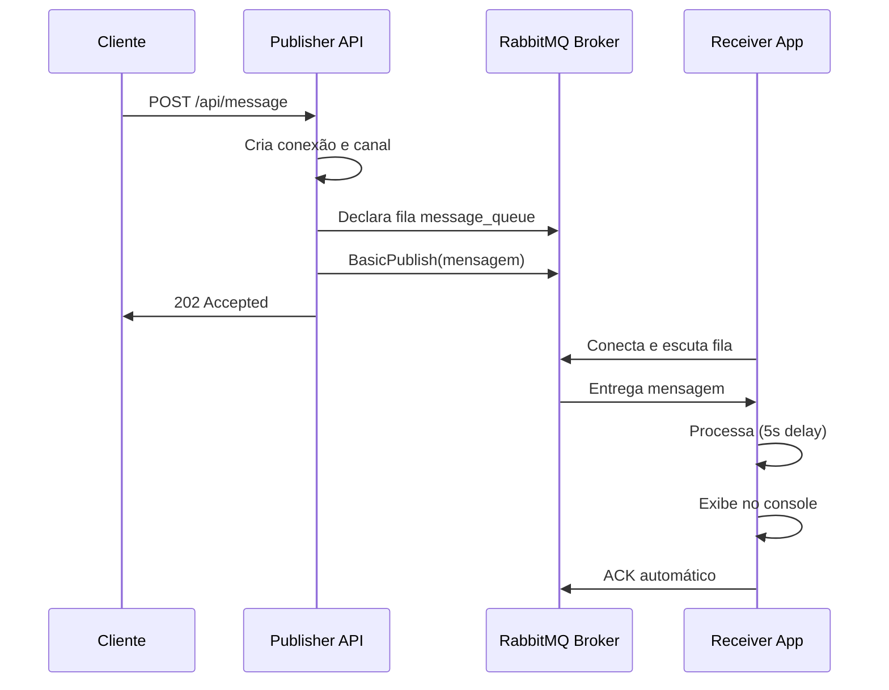
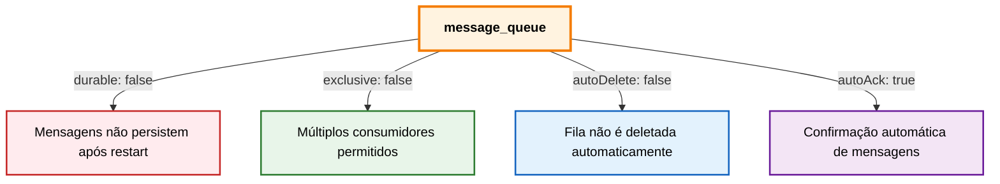
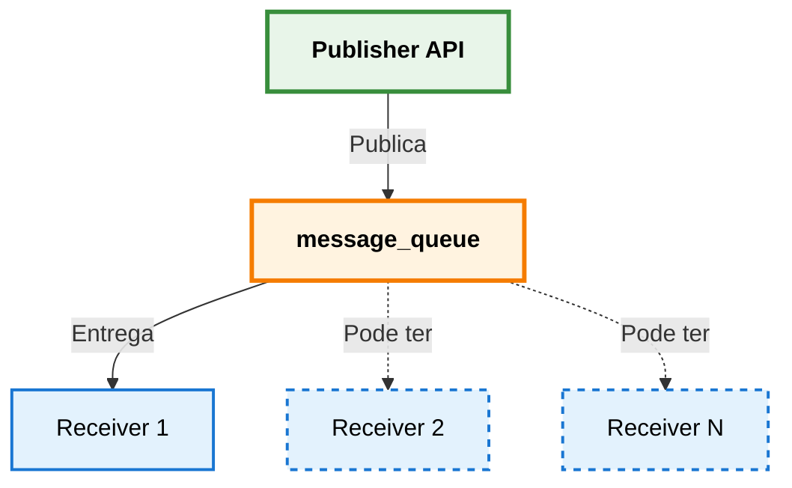
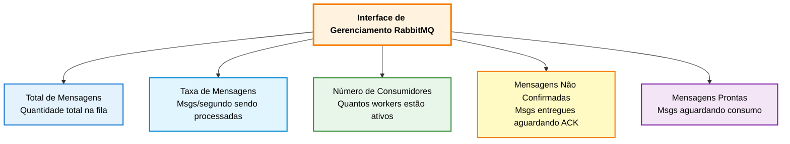
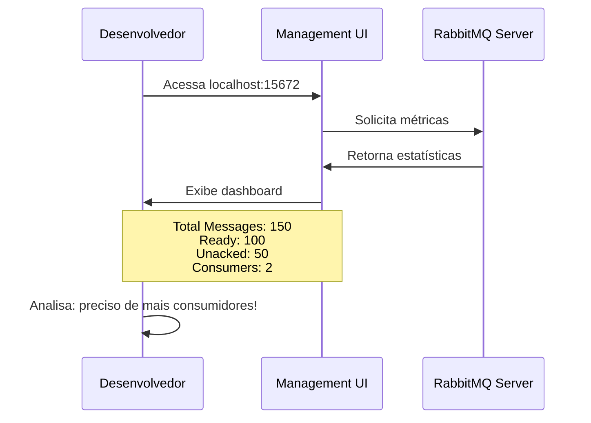

# Sistema de Mensageria com RabbitMQ

<div align="center">

</div>

## Visão Geral

Este projeto demonstra a implementação de um sistema de mensageria assíncrona utilizando RabbitMQ, composto por dois componentes principais: um publicador (Publisher) e um consumidor (Receiver). A solução permite o envio e processamento de mensagens de forma desacoplada e escalável.

⚠️ **Importante**: A branch `main` contém apenas um exemplo básico e **não funcional** de conexão com RabbitMQ. Para ver sistemas completos e funcionando, acesse as branches:
- `exchange/direct` - Direct Exchange (funcional)
- `exchange/fanout` - Fanout Exchange (funcional)
- `exchange/topic` - Topic Exchange (funcional)

## Estrutura de Branches

Este repositório utiliza diferentes branches para demonstrar os diversos tipos de **Exchange** disponíveis no RabbitMQ. Cada branch implementa um padrão específico de roteamento de mensagens:

| Branch | Tipo de Exchange | Status | Descrição |
|--------|-----------------|--------|-----------|
| `main` | **Nenhuma (Base)** | ⚠️ Não funcional | Exemplo básico de conexão e declaração de fila - propositalmente incompleto para fins didáticos |
| `exchange/direct` | **Direct** | ✅ Funcional | Roteamento direto baseado em routing key exata |
| `exchange/fanout` | **Fanout** | ✅ Funcional | Broadcasting - envia mensagens para todas as filas vinculadas |
| `exchange/topic` | **Topic** | ✅ Funcional | Roteamento baseado em padrões de routing key com wildcards |


### Importante sobre a Branch Main

⚠️ **ATENÇÃO**: A branch `main` **NÃO contém um sistema funcional**. Ela serve apenas como **exemplo introdutório** para demonstrar os conceitos mais básicos de:

- Como estabelecer conexão com RabbitMQ
- Como criar um canal (channel)
- Como declarar uma fila (queue)
- Como enviar mensagens para o broker
- Como configurar um consumidor

**A branch main propositalmente contém uma configuração incorreta** para fins didáticos. As mensagens **não chegarão ao consumidor** devido à configuração inadequada do Default Exchange.

#### Por que Deixamos Assim?

Esta configuração **incorreta intencional** na branch `main` serve para:

1. **Demonstrar conceitos básicos**: Conexão, canais, declaração de filas - sem a complexidade de exchanges
2. **Ensinar debugging**: Como identificar problemas de roteamento no RabbitMQ
3. **Introduzir o Default Exchange**: Entender suas regras específicas e limitações
4. **Motivar o estudo**: Mostrar que uma conexão básica não é suficiente para um sistema funcional
5. **Base para aprendizado**: Servir como ponto de partida antes de explorar exchanges mais complexas

⚠️ **A branch main não deve ser usada em produção ou como referência para implementação real.**

**Para ver implementações funcionais e prontas para uso**, explore as outras branches:
- `exchange/direct` - Direct Exchange (implementação completa e funcional)
- `exchange/fanout` - Fanout Exchange (implementação completa e funcional)
- `exchange/topic` - Topic Exchange (implementação completa e funcional)

#### Próximos Passos

Após entender o problema na branch `main`, recomendamos:

1. **Começar pela Direct Exchange**: `git checkout exchange/direct`
   - É a mais simples e direta
   - Ótima para entender o conceito de routing key
   - Sistema completamente funcional

2. **Explorar Fanout Exchange**: `git checkout exchange/fanout`
   - Útil para cenários de broadcasting
   - Não usa routing key, mais simples que Direct

3. **Avançar para Topic Exchange**: `git checkout exchange/topic`
   - Mais flexível com uso de wildcards
   - Ideal para roteamento complexo

## O que é RabbitMQ?

RabbitMQ é um message broker (intermediário de mensagens) open-source que implementa o protocolo AMQP (Advanced Message Queuing Protocol). Ele atua como um intermediário entre aplicações, permitindo que sistemas se comuniquem de forma assíncrona através de filas de mensagens.

### Conceitos Fundamentais

- **Producer (Produtor)**: Aplicação que envia mensagens para a fila
- **Consumer (Consumidor)**: Aplicação que recebe e processa mensagens da fila
- **Queue (Fila)**: Estrutura de dados que armazena mensagens até serem consumidas
- **Message (Mensagem)**: Dados enviados entre aplicações
- **Channel (Canal)**: Conexão virtual dentro de uma conexão TCP
- **Connection (Conexão)**: Conexão TCP com o servidor RabbitMQ

## Arquitetura do Sistema

```mermaid
graph LR
    A[Cliente HTTP] -->|POST /api/message| B[API Publisher]
    B -->|Publica Mensagem| C[RabbitMQ Broker]
    C -->|Armazena| D[message_queue]
    D -->|Consome| E[Receiver Console App]
    E -->|Processa| F[Console Output]
    
    style A fill:#e3f2fd,stroke:#1976d2,stroke-width:2px,color:#000
    style B fill:#e8f5e9,stroke:#388e3c,stroke-width:2px,color:#000
    style C fill:#fff3e0,stroke:#f57c00,stroke-width:2px,color:#000
    style D fill:#fce4ec,stroke:#c2185b,stroke-width:2px,color:#000
    style E fill:#f3e5f5,stroke:#7b1fa2,stroke-width:2px,color:#000
    style F fill:#e0f2f1,stroke:#00796b,stroke-width:2px,color:#000
```



## Estrutura do Projeto

```
rabbitmq-exercise/
├── RabbitMq.Publisher/          # API Web que publica mensagens
│   ├── Controllers/
│   │   └── MessageController.cs # Endpoint REST para envio de mensagens
│   ├── Model/
│   │   └── Message.cs           # Modelo de dados da mensagem
│   └── Program.cs               # Configuração da API
│
└── RabbitMq.Receiver/           # Aplicação Console que consome mensagens
    └── Program.cs               # Consumidor de mensagens
```

## Componentes

### 1. RabbitMq.Publisher (Produtor)

API REST desenvolvida em ASP.NET Core 8.0 que expõe endpoints HTTP para publicação de mensagens no RabbitMQ.

#### Endpoints Disponíveis

**GET /api/message**
- Retorna todas as mensagens publicadas armazenadas em memória
- Resposta: Lista de mensagens

**POST /api/message**
- Publica uma nova mensagem na fila do RabbitMQ
- Body: JSON com estrutura da mensagem
- Resposta: Status 202 (Accepted) com confirmação

#### Modelo de Mensagem

```json
{
  "title": "string",
  "text": "string",
  "author": "string"
}
```

### 2. RabbitMq.Receiver (Consumidor)

Aplicação console que escuta continuamente a fila `message_queue` e processa as mensagens recebidas.

#### Comportamento

- Conecta-se automaticamente ao RabbitMQ no localhost
- Aguarda mensagens na fila `message_queue`
- Processa cada mensagem com delay de 5 segundos (simulação)
- Exibe a mensagem no console após processamento

## Fluxo de Mensagens



## Tecnologias Utilizadas

- **.NET 8.0**: Framework de desenvolvimento
- **ASP.NET Core**: Para criação da Web API
- **RabbitMQ.Client 7.2.0**: Client library oficial do RabbitMQ
- **Swagger/OpenAPI**: Documentação interativa da API
- **System.Text.Json**: Serialização/deserialização de mensagens

## Pré-requisitos

### Instalação do RabbitMQ

1. **Docker (Recomendado)**
   ```bash
   docker run -d --name rabbitmq -p 5672:5672 -p 15672:15672 rabbitmq:3-management
   ```

2. **Instalação Local**
   - Download: https://www.rabbitmq.com/download.html
   - Porta padrão: 5672
   - Interface de gerenciamento: http://localhost:15672
   - Credenciais padrão: guest/guest

### Requisitos de Desenvolvimento

- .NET 8.0 SDK ou superior
- IDE compatível (Visual Studio 2022, VS Code, Rider)
- RabbitMQ Server rodando em localhost

## Como Executar

### 1. Iniciar o RabbitMQ

Certifique-se de que o RabbitMQ está rodando:

```bash
# Se usando Docker
docker start rabbitmq

# Verificar se está funcionando
# Acesse: http://localhost:15672
```

### 2. Executar o Receiver (Consumidor)

```bash
cd RabbitMq.Receiver
dotnet run
```

**Saída esperada:**
```
Aguardando mensagens. Pressione [enter] para sair.
```

### 3. Executar o Publisher (API)

```bash
cd RabbitMq.Publisher
dotnet run
```

**Saída esperada:**
```
Now listening on: https://localhost:7xxx
Now listening on: http://localhost:5xxx
```

### 4. Testar o Sistema

#### Opção 1: Usando Swagger UI

1. Acesse: https://localhost:7xxx/swagger
2. Expanda o endpoint POST /api/message
3. Clique em "Try it out"
4. Insira o JSON:
   ```json
   {
     "title": "Primeira Mensagem",
     "text": "Testando RabbitMQ",
     "author": "Sistema"
   }
   ```
5. Clique em "Execute"

#### Opção 2: Usando cURL

```bash
curl -X POST "https://localhost:7xxx/api/message" \
  -H "Content-Type: application/json" \
  -d '{
    "title": "Teste",
    "text": "Mensagem via cURL",
    "author": "Dev"
  }'
```

#### Opção 3: Usando PowerShell

```powershell
$body = @{
    title = "Teste PowerShell"
    text = "Mensagem via PowerShell"
    author = "Admin"
} | ConvertTo-Json

Invoke-RestMethod -Uri "https://localhost:7xxx/api/message" `
  -Method Post `
  -Body $body `
  -ContentType "application/json"
```

### 5. Verificar o Resultado

No console do **RabbitMq.Receiver**, após 5 segundos, você verá:

```
Mensagem Recebida {"Title":"Primeira Mensagem","Text":"Testando RabbitMQ","Author":"Sistema"}
```

## Configuração da Fila

A fila `message_queue` é declarada com as seguintes características:



### Propriedades da Fila

| Propriedade | Valor | Significado |
|-------------|-------|-------------|
| **durable** | false | Fila não sobrevive ao restart do RabbitMQ |
| **exclusive** | false | Fila pode ser acessada por múltiplas conexões |
| **autoDelete** | false | Fila não é deletada quando não há consumidores |
| **autoAck** | true | Mensagens são automaticamente confirmadas ao serem entregues |

## Padrões de Mensageria Implementados

### Publisher/Subscriber Pattern



Neste padrão:
- O Publisher não conhece quem irá consumir as mensagens
- Consumidores podem ser adicionados ou removidos sem afetar o Publisher
- Processamento assíncrono e desacoplado

## Vantagens da Solução

### Desacoplamento
- Publisher e Receiver não se comunicam diretamente
- Podem ser desenvolvidos, implantados e escalados independentemente
- Mudanças em um componente não afetam o outro

### Escalabilidade
- Múltiplos Receivers podem processar mensagens em paralelo
- Distribuição de carga automática entre consumidores
- Possibilidade de adicionar workers conforme demanda

### Resiliência
- Se o Receiver estiver offline, mensagens permanecem na fila
- Reprocessamento automático em caso de falha (se configurado)
- Sistema continua funcionando mesmo com componentes temporariamente indisponíveis

### Assincronismo
- Publisher não precisa aguardar o processamento
- Resposta imediata ao cliente
- Processamento em background

## Monitoramento

### Management UI do RabbitMQ

Acesse http://localhost:15672 para visualizar:

- **Queues**: Quantidade de mensagens na fila
- **Connections**: Conexões ativas
- **Channels**: Canais abertos
- **Message rates**: Taxa de mensagens/segundo
- **Consumers**: Consumidores ativos

### Métricas Importantes para Monitorar

A interface de gerenciamento do RabbitMQ fornece diversas métricas essenciais para acompanhar a saúde do sistema:



#### Entendendo as Métricas

| Métrica | Descrição | O que observar |
|---------|-----------|----------------|
| **Total de Mensagens** | Soma de todas as mensagens na fila (prontas + não confirmadas) | Crescimento constante indica gargalo no processamento |
| **Taxa de Mensagens** | Velocidade de entrada e saída de mensagens | Entrada maior que saída = acúmulo de mensagens |
| **Número de Consumidores** | Quantidade de aplicações consumindo a fila | Zero consumidores = mensagens não serão processadas |
| **Mensagens Não Confirmadas** | Mensagens entregues mas ainda não confirmadas (ACK pendente) | Muitas mensagens podem indicar processamento lento |
| **Mensagens Prontas** | Mensagens aguardando serem consumidas | Alto número indica necessidade de mais consumidores |

#### Exemplo de Monitoramento



## Referências

- [Documentação Oficial RabbitMQ](https://www.rabbitmq.com/documentation.html)
- [RabbitMQ .NET Client Guide](https://www.rabbitmq.com/dotnet-api-guide.html)
- [AMQP Protocol](https://www.amqp.org/)
- [Tutoriais RabbitMQ](https://www.rabbitmq.com/getstarted.html)

## Glossário

| Termo | Definição |
|-------|-----------|
| **AMQP** | Advanced Message Queuing Protocol - protocolo de mensageria |
| **Broker** | Intermediário que gerencia filas e roteamento de mensagens |
| **Exchange** | Roteador que recebe mensagens e as distribui para filas |
| **Binding** | Regra que conecta exchange a uma fila |
| **Routing Key** | Chave usada pelo exchange para rotear mensagens |
| **Acknowledgment (ACK)** | Confirmação de que uma mensagem foi processada |
| **Prefetch** | Número de mensagens não confirmadas que um consumidor pode receber |
| **Virtual Host** | Namespace lógico para separação de ambientes |

## Licença

Este projeto é um exemplo educacional para demonstração de conceitos de mensageria com RabbitMQ.

---

**Desenvolvido para fins de aprendizado e demonstração de conceitos de arquitetura distribuída.**
